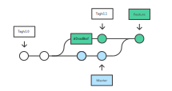

import { Head, Notes } from 'mdx-deck'
const BS = ()=>"\\";
export { default as theme } from './theme'


<Head>
  <title>Git Download Manager</title>
</Head>

# Git Download Manager 
## Challanges and Opportunities

```json
{
  "Speaker": "Gaetano Checinski",
  "Company": "LoopPerfect"
  "Role": "Founder & Software Architect"
}
```

---

## Buckaroo - Decentralized Package Manager


<Notes>
  <p> Buckaroo is completely decentralized and leverages Git </p>
  <p> Git used for versioning and to guarantee reproducibility </p>
  <p> #LiveAtHead mentality </p>
  <p> Creates Monorepo on the fly from many small packages </p> 
  <p> No Publishing of packages to a registry required </p>
</Notes>

---

# How to Downlaod Commit #deadbeef 
## from git@github.com:loopperfect/RxTerm.git?

---

# Why not ... ?

## `git clone $URL && git checkout #deadbeef`

<Notes>
  <p> Too Slow! It downlaods everything in the repository </p>
  <p> How would you do it? </p>
</Notes>

---

# Does ... work ?

## `git clone --depth=1 -n $URL && git fetch #deadbeef`

<Notes>
  <p> It depends... </p>
  <p> Is the commit an advertised object?  </p>
</Notes>

---

# Why doesn't it work?

## error: Server does not allow request for unadvertised object #deadbeef

<Notes>
  <p> This is the most likely error you will get </p>
</Notes>

---

# What is an Advertised Object?

- tips of branches
- tags

---

# How to discover all Advertised Objects?

## `git ls-remote --all`

---

# Why doesn't it work? - Part II

- Git needs to compute a diff between the your local commits 
  and the requested commit, but... 
- Git's commits are a singly linked list
- Every commit only knows it's parent
- Heads, Tags are references to a commit
- Which Tag or Head should Git walk to find #deadbeef?

---

# Why doesn't it work? - Part III



<Notes>
  <p> How to Get #DeadBeef? </p>
  <p> We can only start our random walk from a reference </p>
  <p> Quickest path is to Fetch Tag/v1.1 and it's parent </p>
  <p> But how can we know? </p>
</Notes>

---

# Git! Just make it work!

```
[uploadpack]
    allowTipSha1InWant = true
    allowReachableSHA1InWant = true
    allowAnySHA1InWant = true
``` 

## Most Git Hosts disable this features

---

# Github API

## https://github.com/{owner}/{projectname}/archive/{sha}.zip

<Notes>

Fast downlaod of commit but moving between commits slow.

</Notes>

---

# Git Shallow + Fetch + Heuristics

- Use Hints in Manifests and Lockfiles about branches
- `Git clone --depth=1 -n $URL#branchThatLikelyHasDeadBeef`
- `git fetch --deepen=$N` to get N commits
- repeat `fetch` if commit not found. exponentially increase N
- Inspect Datetime and fetched (SemVer-) Tags to determine if you should give up
- Repeat process for alternative branches
- Give up and unshallow Repository by fetching the remaining diffs 

---

# How to Copy Commit from (Bare) Repo Cache?

## `git clone --shared -n path/to/cache.git && git checkout #deadbeef`

- All commits in cache.git available in cloned repos

## `git clone --reference path/to/cache.git git@github.com/owner/repo.git`

- creates a real clone but speeds up download by using the cache.git

---


## Buckaroo - Decentralized Package Manager


<https://www.buckaroo.pm>
